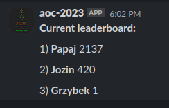

# AOC-SLACK

Slack bot for Advent of Code.

## Features

### Posting messages about solved puzzles to Slack channels in real time.


### Posting a message with leaderboard at the end of the day.



## Installation

To install slack bot you need to add slack app to your workspace and host aoc-slack bot somewhere.

### Add app to your slack workspace

1. Go to https://api.slack.com/apps and create a new app.
2. Select "From scratch" and give it a name and workspace.
3. Select incoming webhooks and activate it.
4. Click "Add new webhook to your workspace" and select a channel to which you want to receive messages.

### Host aoc-slack bot

To run aoc-slack in docker you need to run the following command:

```shell
docker run -e AOC_SLACK_LEADERBOARD_ID=<leaderboard_id> \
           -e AOC_SLACK_SESSION=<aoc_session> \
           -e AOC_SLACK_WEBHOOK_URL=<slack_app_webhook_url> \
           -d \
           1grzyb1/aoc-slack:latest
```

#### Properties description

| Property                              | Description                                                                                       |
|---------------------------------------|---------------------------------------------------------------------------------------------------|
| AOC_SLACK_LEADERBOARD_ID _(required)_ | ID of your private leaderboard in advent of code                                                  |
| AOC_SLACK_SESSION _(required)_        | Session header from aoc website                                                                   |
| AOC_SLACK_WEBHOOK_URL _(required)_    | URL to slack app webhook                                                                          |
| AOC_SLACK_YEAR                        | Year for which bot should work (_default current year_)                                           |
| AOC_SLACK_STARS_CRON                  | Cron how often new stars should be refreshed (_default every 15min. Minimum approved by aoc API_) |
| AOC_SLACK_LEADERBOARD_CRON            | Cron how when leaderboard should be sent (_default midnight EST (UTC-5)_)     |